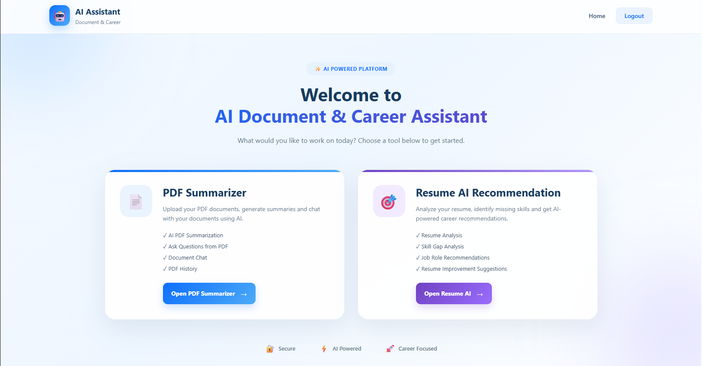
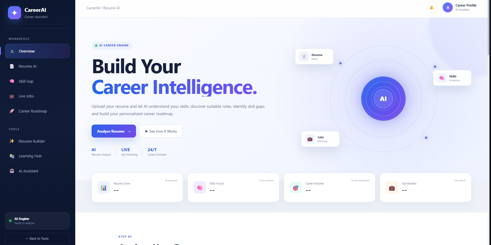

🚀 CareerAI
AI-Powered Career Guidance, Resume Building, Learning & Job Recommendation Platform

CareerAI is a full-stack web application designed to help students and job seekers manage their career journey from one platform. It combines AI assistance, PDF analysis, resume building, resume recommendations, live job recommendations, learning resources, and personalized progress tracking.

📌 Table of Contents
About CareerAI

Project Objectives

Key Features

Application Workflow

Technologies Used

Project Structure

Requirements

Installation

Environment Variables

Run the Application

Feature Details

Screenshots

API Configuration

Google OAuth Configuration

Database

Deployment

Security

Testing Checklist

Future Enhancements

Troubleshooting

Contributing

Author

License

🤖 About CareerAI
CareerAI provides an integrated career-support environment where users can:

Ask questions through an AI Assistant.

Upload and analyze PDF documents.

Build professional resumes.

Receive resume and career recommendations.

Discover live job opportunities.

Learn technical and career-related skills.

Track completed lessons and learning progress.

Access personalized tools from a dashboard.

Sign in using traditional authentication or Google OAuth.

The goal is to reduce the need for multiple separate career tools by bringing important career-development features into one application.

🎯 Project Objectives
The main objectives of CareerAI are:

Provide AI-powered career assistance.

Help users create professional resumes.

Analyze resumes and provide recommendations.

Provide access to current job opportunities through a job API.

Support structured learning through the Learning Hub.

Store user-specific learning progress.

Provide PDF analysis and summarization.

Provide secure user authentication.

Create a centralized career dashboard.

Provide a foundation that can be extended into a larger AI career platform.

✨ Key Features
🤖 1. AI Assistant
CareerAI includes an AI-powered assistant for career and technical questions.

Features include:

AI-powered responses.

Career guidance.

Technical questions.

General assistance.

Conversation support.

Gemini API integration.

📄 2. PDF AI Assistant
Users can upload PDF documents and use AI to understand them.

Features include:

PDF upload.

PDF content analysis.

Summarization.

Question answering based on document content.

AI-assisted document understanding.

📝 3. Resume Builder
The Resume Builder allows users to create a professional resume step by step.

Features include:

Personal information.

Education details.

Skills.

Experience.

Projects.

Resume generation.

Resume download.

🎯 4. Resume Recommendation
CareerAI provides resume-related recommendations to help users improve their resume and career profile.

Possible recommendations include:

Skill improvement.

Resume content suggestions.

Career-related guidance.

Profile improvement suggestions.

💼 5. Live Job Recommendations
CareerAI can connect to a job API to retrieve current job opportunities.

The Live Jobs feature is intended to help users discover opportunities based on their career interests and skills.

The required API key must be stored securely as an environment variable.

Example:

JOB_API_KEY=your_job_api_key
Important: Never place the real API key inside this README or commit it to GitHub.

📚 6. Learning Hub
The Learning Hub provides structured learning content.

Features include:

Multiple courses.

Detailed lessons.

Concepts and explanations.

Examples.

Code examples where applicable.

Practice questions.

Mini tasks.

Lesson completion.

User-specific learning progress.

👤 7. User Authentication
CareerAI supports user authentication features such as:

User registration.

Login.

Logout.

Forgot password.

Password reset.

Google OAuth login.

📊 8. User Dashboard
The dashboard acts as the central location for CareerAI features.

Users can access:

AI Assistant.

PDF AI Assistant.

Resume Builder.

Resume Recommendation.

Live Jobs.

Learning Hub.

Other career tools.

🔄 Application Workflow
                    ┌──────────────────┐
                    │     CareerAI     │
                    └────────┬─────────┘
                             │
             ┌───────────────┼───────────────┐
             │               │               │
             ▼               ▼               ▼
       Authentication     Dashboard      AI Assistant
             │               │               │
             │       ┌───────┼───────┐       │
             │       │       │       │       │
             ▼       ▼       ▼       ▼       ▼
          Profile  Resume  Jobs   Learning  PDF AI
                    │       │       │
                    ▼       ▼       ▼
                Resume   Live Jobs  Progress
             Recommendation
🛠️ Technologies Used
Frontend
HTML5

CSS3

JavaScript

Jinja2 Templates

Backend
Python

Flask

Database
SQLite

Artificial Intelligence
Google Gemini API

Authentication
Flask Sessions

Google OAuth

Deployment
Render or another Flask-compatible hosting platform

Version Control
Git

GitHub

📁 Project Structure
The project follows a Flask-based structure similar to:

CareerAI/
│
├── app.py
├── database.py
├── ai_service.py
├── requirements.txt
├── README.md
├── .gitignore
├── .env
│
├── templates/
│   ├── login.html
│   ├── register.html
│   ├── dashboard.html
│   ├── resume_builder.html
│   ├── lesson.html
│   ├── forgot_password.html
│   ├── reset_password.html
│   └── ...
│
├── static/
│   ├── css/
│   ├── js/
│   └── ...
│
├── uploads/
│
└── screenshots/
    ├── login.png
    ├── dashboard.png
    ├── pdf_summraizer.png
    ├── resume-recommendation.png
The exact files and folders can vary depending on the current version of the project.

💻 Requirements
Before running CareerAI, install:

Python 3.x

pip

Git

A modern web browser

Required Python packages from requirements.txt

API credentials are required for AI, job, and Google authentication features.

⚙️ Installation
Step 1 — Clone the repository
git clone https://github.com/YOUR_USERNAME/careerai.git
cd careerai
Replace YOUR_USERNAME with the GitHub username that owns the repository.

Step 2 — Create a virtual environment
Windows
python -m venv venv
Activate it:

venv\Scripts\activate
macOS / Linux
python3 -m venv venv
Activate it:

source venv/bin/activate
Step 3 — Install dependencies
pip install -r requirements.txt
🔐 Environment Variables
Create a .env file in the project root.

Example:

GEMINI_API_KEY=your_gemini_api_key
JOB_API_KEY=your_job_api_key
GOOGLE_CLIENT_ID=your_google_client_id
GOOGLE_CLIENT_SECRET=your_google_client_secret
SECRET_KEY=your_secret_key
Environment Variable Description
Variable	Purpose
GEMINI_API_KEY	Access to Google Gemini AI
JOB_API_KEY	Access to the configured job API
GOOGLE_CLIENT_ID	Google OAuth client ID
GOOGLE_CLIENT_SECRET	Google OAuth client secret
SECRET_KEY	Flask session/security key
⚠️ Important
Never commit this file:

.env
Add it to .gitignore:

.env
venv/
.venv/
__pycache__/
*.pyc
▶️ Run the Application
Activate your virtual environment and run:

python app.py
The application should normally be available at:

http://127.0.0.1:5000
You can also use:

http://localhost:5000
🧩 Feature Details
AI Assistant
The AI Assistant uses the configured Gemini API to generate responses.

Basic flow:

User Question
     ↓
Flask Backend
     ↓
AI Service
     ↓
Gemini API
     ↓
AI Response
     ↓
CareerAI Interface
PDF AI Assistant
Basic flow:

PDF Upload
     ↓
PDF Processing
     ↓
Text Extraction
     ↓
AI Processing
     ↓
Summary / Answers
Resume Builder
Basic flow:

User Information
       ↓
Resume Form
       ↓
Resume Data
       ↓
Resume Generation
       ↓
Download
Resume Recommendation
Basic flow:

Resume / User Profile
        ↓
Analysis
        ↓
Skills / Career Information
        ↓
Recommendations
        ↓
User Improvements
Live Jobs
Basic flow:

User Search / Career Interest
          ↓
Job API
          ↓
Live Job Data
          ↓
Filtering / Display
          ↓
Job Opportunities
The exact job API depends on the API service configured by the project.

Learning Progress
Learning progress is intended to be associated with the logged-in user.

Conceptually:

User
 ↓
Course
 ↓
Lesson
 ↓
Mark Complete
 ↓
Database
 ↓
User-specific Progress
This allows different users to maintain separate learning progress.

🖼️ Screenshots
Place project screenshots inside:

screenshots/
Recommended files:

screenshots/
├── login_ai.png
├── dashboard.png
├── pdf-summraizer.png
├── resume-recommendation.png
🔐 Login Page

🏠 Dashboard

📄 PDF AI Assistant

🎯 Resume Recommendation

If a screenshot is not available yet, remove that image line until the corresponding image is added.

🔑 API Configuration
CareerAI may require multiple external services.

Gemini API
Add:

GEMINI_API_KEY=your_gemini_api_key
The Gemini API is used for AI-powered functionality.

Job API
Add the job API credential used by your application:

JOB_API_KEY=your_job_api_key
The exact variable name must match the variable used in the application's Python code.

Do not publish the actual job API key.

Google OAuth
Add:

GOOGLE_CLIENT_ID=your_google_client_id
GOOGLE_CLIENT_SECRET=your_google_client_secret
Google OAuth requires the correct authorized origins and redirect URLs.

🔐 Google OAuth Configuration
For local development, configure the Google OAuth application with:

Authorized JavaScript Origins
http://127.0.0.1:5000
http://localhost:5000
Authorized Redirect URIs
http://127.0.0.1:5000/google-callback
http://localhost:5000/google-callback
For a deployed application, replace the local URL with the live application URL.

Example:

https://your-app.onrender.com/google-callback
Use the exact URL generated by your hosting provider.

🗄️ Database
The development version of CareerAI uses SQLite.

Possible database files may include application-specific SQLite databases.

SQLite is convenient for:

Development

Testing

Educational projects

Small demonstrations

For a production application with multiple users and persistent data, a managed database such as PostgreSQL is recommended.

🌐 Deployment
CareerAI can be deployed to a Flask-compatible hosting platform such as Render.

Render Deployment
1. Push project to GitHub
From the project folder:

git init
git add .
git commit -m "Initial CareerAI project"
git branch -M main
git remote add origin https://github.com/YOUR_USERNAME/careerai.git
git push -u origin main
2. Create a Render Web Service
In Render:

New
 ↓
Web Service
 ↓
Connect GitHub Repository
 ↓
Select CareerAI Repository
3. Build Command
Use:

pip install -r requirements.txt
4. Start Command
If the Flask application object is named app inside app.py:

gunicorn app:app
5. Add Environment Variables
Add the same required variables in the hosting platform:

GEMINI_API_KEY
JOB_API_KEY
GOOGLE_CLIENT_ID
GOOGLE_CLIENT_SECRET
SECRET_KEY
Do not upload .env to GitHub.

6. Update Google OAuth
After deployment, update Google OAuth with the live callback URL:

https://YOUR-APP.onrender.com/google-callback
⚠️ Production Database Note
A normal SQLite file on a cloud service may not provide reliable persistent storage across deployments/restarts.

For a production multi-user application, use a persistent database such as PostgreSQL.

Uploaded files also need an appropriate persistent/object-storage solution if they must survive deployments.

🔒 Security
Security is important when deploying CareerAI.

Never commit:
.env
API keys
OAuth secrets
Passwords
Private credentials
Use:
Environment variables for secrets.

Strong Flask SECRET_KEY.

Authentication checks on protected routes.

Input validation.

Secure file-upload validation.

Production HTTPS.

Secure database configuration.

Proper OAuth redirect configuration.

🧪 Testing Checklist
Before deployment, test the following:

Authentication
Registration

Login

Logout

Google Login

Forgot Password

Reset Password

AI
AI Assistant

Large prompts

AI error handling

Gemini API configuration

PDF
PDF upload

PDF processing

PDF summarization

PDF question answering

Resume
Resume form

Resume generation

Resume download

Resume recommendation

Dashboard navigation

Jobs
Job API connection

Job search

Job results

API error handling

Learning
Course list

Lesson page

Detailed lesson content

Mark lesson complete

User-specific progress

Deployment
Environment variables

Production URL

Google OAuth callback

Database persistence

File storage

HTTPS

🐛 Troubleshooting
Gemini API Error
Check:

GEMINI_API_KEY
Make sure the key is available in the environment where the application is running.

Google Login Not Working
Check:

Google Client ID.

Google Client Secret.

Authorized JavaScript origins.

Authorized redirect URI.

Production callback URL.

Job API Not Working
Check:

JOB_API_KEY
Also verify that the configured job API is active and that its endpoint/request format matches the application code.

Application Does Not Start
Try:

pip install -r requirements.txt
Then:

python app.py
Check the terminal for the exact error message.

GitHub Push Problems
Check:

git status
Then:

git add .
git commit -m "Update CareerAI"
git push
Make sure .env is excluded before pushing.

📈 Future Enhancements
Possible future improvements include:

Advanced AI career recommendations.

More job sources.

Job application tracking.

Resume ATS scoring.

Advanced resume templates.

Interview preparation.

AI mock interviews.

Skill-gap analysis.

Personalized learning paths.

Email notifications.

Saved jobs.

Job alerts.

Admin dashboard.

Analytics dashboard.

PostgreSQL production database.

Cloud file storage.

More AI models.

Mobile application.

🤝 Contributing
Contributions are welcome.

General workflow:

git clone <repository-url>
cd careerai
Create a feature branch:

git checkout -b feature/new-feature
Make your changes, then:

git add .
git commit -m "Add new feature"
git push origin feature/new-feature
Create a pull request through GitHub.

👩‍💻 Author
CareerAI Project

Developed as an AI-powered career assistance platform for students and job seekers.

📄 License
This project is developed for educational and project purposes.

If you plan to distribute or commercialize the application, add an appropriate open-source or proprietary license.

⭐ CareerAI at a Glance
┌─────────────────────────────────────────────┐
│                  CAREERAI                   │
├─────────────────────────────────────────────┤
│                                             │
│  🤖 AI Assistant                            │
│  📄 PDF AI Assistant                        │
│  📝 Resume Builder                          │
│  🎯 Resume Recommendation                   │
│  💼 Live Job Recommendations                │
│  📚 Learning Hub                            │
│  👤 Authentication                           │
│  📊 Personalized Dashboard                  │
│                                             │
└─────────────────────────────────────────────┘
CareerAI — One platform for AI-powered career growth. 🚀

